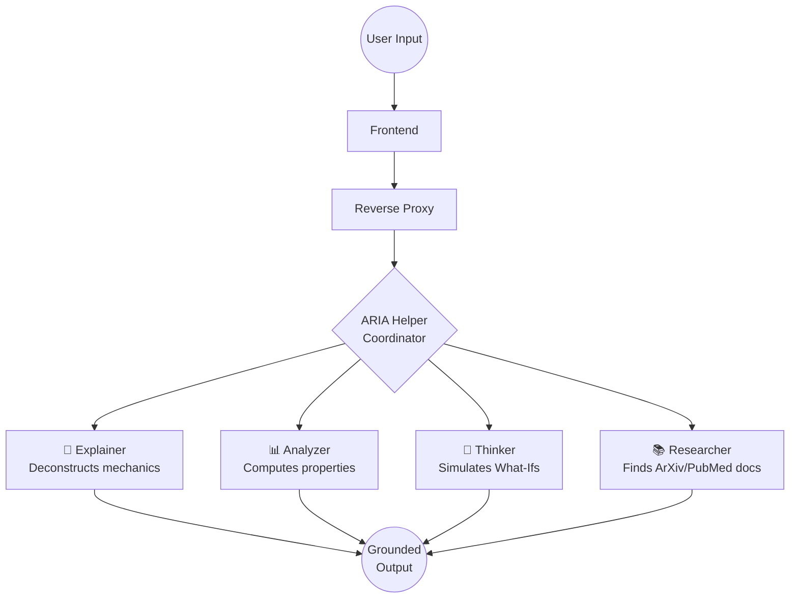

<div align="center">
  

  <h1>EUREKA: The JARVIS-Style Virtual Lab</h1>

  <p>
    <strong>An AI-powered 3D experimental laboratory making complex scientific discovery accessible to everyone, everywhere, for free.</strong>
  </p>

  <p>
    <a href="https://github.com/Minato95-ayu/EUREKA/blob/main/LICENSE"></a>
    <a href="https://github.com/Minato95-ayu/EUREKA/stargazers"></a>
    <a href="https://github.com/Minato95-ayu/EUREKA/network/members"></a>
    <a href="https://github.com/Minato95-ayu/EUREKA/issues"></a>
  </p>

  <p>
    
    
    
    
  </p>

  <h3>
    <a href="#-quick-start">Quick Start</a>
    <span> | </span>
    <a href="#-the-vision">Vision</a>
    <span> | </span>
    <a href="#-architecture">Architecture</a>
    <span> | </span>
    <a href="#-roadmap">Roadmap</a>
  </h3>
</div>

<br/>

## 🌟 The Vision

**EUREKA** is a revolutionary open-source, AI-powered virtual simulation space inspired by JARVIS-like lab environments. It bridges physical properties with interactive 3D structures.

Imagine a user flow where you search for "car engine," explore it in 3D, and seamlessly zoom down from the macroscopic block to the internal pistons, all the way to the molecular structure of the steel alloy. You can manipulate these components, run what-if simulations, and converse with **ARIA** (AI Research and Innovation Assistant) to receive explanations, predictions, and research-backed guidance.

<div align="center">
  
  <p><em>The EUREKA Cyber-Lab Dashboard featuring real-time particle tracking, interactive 3D, and ARIA communications.</em></p>
</div>

---

## ✨ Key Features

| 🚀 Feature | 💡 Description |
| :--- | :--- |
| **Recursive 3D Exploration** | Zoom continuously from a complete object (e.g., Saturn V rocket) down to component metadata, molecules, and atoms. |
| **Multi-Agent AI Mesh** | Powered by **ARIA**, EUREKA coordinates 5 specialized agents (Explainer, Analyzer, Thinker, Researcher, Helper) for deep scientific analysis. |
| **Natural User Interfaces (NUI)** | Control the viewport with Hand Gestures via MediaPipe (pinch zoom, closed fist reset) and interact via direct Voice Commands. |
| **Dual Simulation Engines** | Includes a real-time Verlet particle physics engine and an RDKit chemistry engine to evaluate structural forces and molecular logic. |
| **Grounded in True Science** | Ingests structural context from Wikipedia and extracts citations directly from ArXiv and PubMed to prevent AI hallucinations. |
| **Cloud/Colab Hybrid Ready** | Move heavy AI inferences and simulations to the cloud, allowing the interactive 3D frontend to run beautifully on weak local hardware. |

---

## 🤖 ARIA & The Multi-Agent Mesh

EUREKA coordinates specialized AI experts under ARIA to provide comprehensive and grounded analysis.



---

## 🏗️ Architecture & Tech Stack

EUREKA is a highly modular, microservice-ready platform with clear separation between logic layers.

### 💻 Technologies Used

*   **Frontend**: React 19, TypeScript, Three.js, React Three Fiber, MediaPipe.
*   **Backend**: Python 3.11+, FastAPI, SQLAlchemy, Cython (`uvloop`), C++ (RDKit bindings).
*   **AI/LLM**: Google Gemini 1.5 Flash (Primary), Ollama (Local Llama 3 fallback).
*   **Data & Infra**: PostgreSQL 15 (pgvector), Redis 7, Docker, Kubernetes, Nginx.
*   **Automation**: Node.js, TypeScript, BullMQ, Puppeteer (for academic crawling).

---

## 🚀 Quick Start

Get your own JARVIS-style lab running locally in minutes.

### 1. Prerequisites
- [Docker & Docker Compose](https://docs.docker.com/get-docker/)
- API Key from [Google AI Studio](https://aistudio.google.com/) (Free)

### 2. Environment Setup
Clone the repo and configure your environment:
```bash
git clone https://github.com/Minato95-ayu/EUREKA.git
cd EUREKA

# Copy the example environment files
cp eureka-backend/.env.example eureka-backend/.env
```
> **Note:** Edit `eureka-backend/.env` and insert your `GEMINI_API_KEY`.

### 3. Launch via Docker (Recommended)
```bash
docker-compose up --build -d

# Optional: Initialize local fallback model (Ollama)
docker-compose exec ollama ollama pull llama3
```

*   **🧪 Cyber-Lab Interface**: [http://localhost:3000](http://localhost:3000)
*   **⚙️ FastAPI Swagger Docs**: [http://localhost:8000/docs](http://localhost:8000/docs)

<details>
<summary><strong>Alternative: Manual Local Development Setup</strong></summary>

**Backend:**
```bash
cd eureka-backend
python -m venv venv
source venv/bin/activate  # Or .\venv\Scripts\activate on Windows
pip install -r requirements.txt
python main.py
```

**Frontend:**
```bash
cd eureka-frontend
npm install
npm run dev
```
</details>

---

## 🗺️ Project Roadmap

EUREKA is actively evolving based on the [Missing Features Build Plan](docs/MISSING_FEATURES_BUILD_PLAN.md).

- [x] **Phase 1**: Cyber-Lab Dashboard Shell & Procedural 3D.
- [x] **Phase 2**: Voice Input & MediaPipe Hand Gesture Controls.
- [x] **Phase 3**: Curated "Search-to-3D" Object Schema & Hierarchy.
- [ ] **Phase 4**: Real-time Interactive What-If Simulation Engine.
- [ ] **Phase 5**: RAG-style Context Assembly (ArXiv/PubMed citations on screen).
- [ ] **Phase 6**: Hybrid Cloud/Colab Architecture Optimization.
- [ ] **Phase 7**: Fully Autonomous Batch Experimentation Workflows.

---

## 🤝 Contributing

We welcome contributions from researchers, 3D artists, AI engineers, and frontend wizards! 

1. Check out our [Contributing Guide](docs/CONTRIBUTING.md) (coming soon).
2. Look for issues labeled `good first issue` or `help wanted`.
3. Fork the repository, create a branch, and submit a Pull Request.

---

## 🛡️ Security & Testing

EUREKA prioritizes data integrity and system security:
- Secure JWT (HS256) session sign-in and stateless architecture.
- Extensive test coverage using `pytest`.
- Docker processes executed safely under non-privileged definitions.

To run the backend test suite locally:
```bash
cd eureka-backend
pytest -v --cov=app
```

---

## 👑 Creator

**Ayush Kaushik**
- 💻 Lead Architect & Full-Stack AI Engineer
- 🌐 [GitHub: @Minato95-ayu](https://github.com/Minato95-ayu)
- ✉️ ayushkaushik1441@gmail.com

---

## 📄 License & Citation

Distributed under the **MIT License**. See `LICENSE` for more information.

If you leverage EUREKA in an academic context or research paper, please cite the project:

```bibtex
@software{eureka_virtual_lab_2026,
  title={EUREKA: The JARVIS-Style Virtual Research Lab},
  author={Kaushik, Ayush},
  year={2026},
  url={https://github.com/Minato95-ayu/EUREKA}
}
```

<div align="center">
  <p>Made with ❤️ for scientific education and global research.</p>
  <p><strong>EUREKA — Where Discovery Begins. 🔬🚀</strong></p>
</div>
