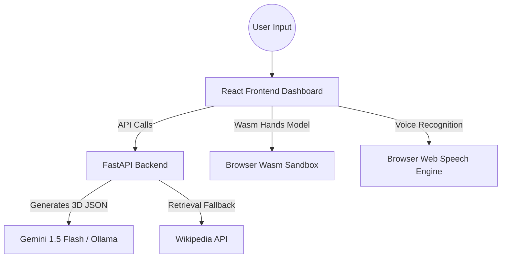

# EUREKA: AI-Powered Virtual 3D Research Lab

🔬 A web-based virtual laboratory environment for searching and exploring mechanical and molecular structures in interactive 3D, controlled by voice and hand gestures.

> **Honest Project Status**: EUREKA is currently a functional MVP. It has a modular React + Three.js (R3F) frontend and a FastAPI backend. Core interactive structures (webcam hand gestures, local voice commands, and Wikipedia-informed 3D procedural object generation) are fully implemented. Physics simulations and automated scrapers are scaffolded or partially integrated.

---

## 📖 Table of Contents

- [💡 Project Overview & Reality Check](#-project-overview--reality-check)
- [✨ Implemented Features](#-implemented-features)
- [🧠 Architecture & Communication Flow](#-architecture--communication-flow)
- [💻 Tech Stack & Performance Engines](#-tech-stack--performance-engines)
- [📂 Project Directory Layout](#-project-directory-layout)
- [🚀 Quick Start (Docker & Local)](#-quick-start-docker--local)
- [🧪 Automated Test Suite](#-automated-test-suite)
- [👑 Founder & Developer](#-founder--developer)
- [📄 License & Citation](#-license--citation)

---

## 💡 Project Overview & Reality Check

EUREKA acts as a "JARVIS-style" interactive dashboard for scientific modeling. Users can search for a device (e.g. "car engine", "jet engine", "microscope", "rocket") or a chemical structure. The system builds a component graph of the device, rendering it on an interactive WebGL canvas.

### 🎥 Demo Preview
The frontend features a responsive glassmorphic cyber-lab dashboard consisting of:
*   **Research View**: Main 3D viewport canvas displaying exploded or solid assemblies.
*   **Status View**: Telemetry dashboard checking FastAPI backend health (Postgres, Redis, Ollama).
*   **Batch & Pipeline Views**: Controls for active and pending simulation pipelines.
*   **Results View**: Displays dynamically-fetched papers matching the active research query.

---

## ✨ Implemented Features

### 1. Refactored Component Architecture
Originally built as a monolithic `App.tsx` file of 1700+ lines, the frontend is refactored into modular components and hooks:
*   `src/types/index.ts`: Shared TypeScript interfaces.
*   `src/services/api.ts`: API layer fetching health, simulations, agent processing, and Wikipedia research.
*   `src/hooks/`: Modular hooks for speech recognition (`useVoiceControl`) and webcam hand tracking (`useHandTracking`).
*   `src/components/canvas/`: Modular Three.js/R3F rendering layers (`LabScene`, `ComponentMesh`, `GltfModelWrapper`).
*   `src/components/dashboard/`: Individual tabs (`StatusScreen`, `BatchScreen`, `PipelineScreen`, `ResultsScreen`, `ResearchScreen`).
*   `src/components/layout/`: Global layout headers, footers, and panels (`TopBar`, `BottomNav`, `AriaPanel`).

### 2. Search-to-3D Object Generation
*   **Ollama/Gemini Generation**: Queries the backend to compile a 3D component hierarchy JSON for the searched term.
*   **Wikipedia Fallback Generator**: If the AI model or backend is offline, the frontend falls back to scraping Wikipedia's summary API and generating procedural mechanical/molecular models dynamically.

### 3. Natural User Interfaces (NUI)
*   **MediaPipe Hand Tracking**: Integrates webcam frames with MediaPipe's Wasm library inside the browser (running at 60 FPS) to support gestures:
    *   *Pinch Fingers*: Interactive Zoom.
    *   *Clench Fist*: Reset Camera and Explode factor.
    *   *Index Point*: Select and inspect individual 3D components.
    *   *Horizontal Swipe*: Switch active navigation tabs.
*   **Voice Control & Speech Synthesis**: Uses the browser's native Web Speech API to capture spoken commands (e.g., *"dismantle cover"*, *"reset"*, *"pass aao"*) and verbally respond using ARIA.

### 4. Simulations & Telemetry (Partial Connection)
*   **Batch Pipeline**: Connects directly to the FastAPI `/api/simulations` endpoints. Users can trigger "+ New Batch" to spin up simulated molecular dynamics processes.
*   **Fluctuating Metrics**: Real-time mock telemetry calculations showing CPU usage, memory utilization, and log updates to simulate a running lab environment.

---

## 🧠 Architecture & Communication Flow



| Component | Status | Description |
| :--- | :--- | :--- |
| **R3F Viewport** | **Implemented** | Glassmorphic React Three Fiber viewport with full component selection and exploded visualization sliders. |
| **ARIA Agent** | **Partial** | Frontend handles speech and chat prompts, which are processed by backend agents using basic keyword parsing. |
| **Simulations** | **Partial** | Backend has Verlet and RDKit engines; frontend can list and create simulations, but deep graphical telemetry integration is in progress. |
| **Telemetry & Scraping** | **Scaffolded** | `eureka-automation` includes TypeScript/Puppeteer/BullMQ structures for crawling, ready to be linked with the Postgres DB. |

---

## 💻 Tech Stack & Performance Engines

*   **Frontend**: React 19, TypeScript, Vite, React Three Fiber (R3F), `@react-three/drei` (CSG and GLTF wrappers).
*   **Backend**: Python 3.11, FastAPI, SQLAlchemy, Uvicorn, SlowAPI (Rate limiting).
*   **AI & Computer Vision**: Google Gemini 1.5 Flash, MediaPipe Hands (via browser WebAssembly).
*   **Chemistry & Simulation**: RDKit (native C++ bindings in Python), 3D Verlet physics solvers.

---

## 📂 Project Directory Layout

```bash
EUREKA/
├── eureka-backend/             # FastAPI Backend Service
│   ├── app/
│   │   ├── agents/             # AI Agent orchestrators (Helper, Explainer, Thinker)
│   │   ├── api/                # FastAPI Routers (Simulations, Objects, Health)
│   │   ├── services/           # Backend physics, RDKit, and Blender caches
│   │   └── data/               # Procedural 3D model JSON presets
│   └── main.py                 # Core server entry point
│
├── eureka-frontend/            # React Client Application
│   ├── src/
│   │   ├── components/         # Modular Canvas, Dashboard, and Layout files
│   │   ├── hooks/              # VoiceControl and HandTracking hooks
│   │   ├── services/           # API integration service layer
│   │   ├── data/               # Constants and fallback generators
│   │   └── App.tsx             # Clean main orchestrator
│   └── package.json
│
├── eureka-automation/          # TypeScript scrapers & background queues
├── kubernetes/                 # Production orchestration manifests (Scaffolded)
└── docker-compose.yml          # Container configuration for local deployment
```

---

## 🚀 Installation & Setup

### Option 1: Launch via Docker Compose (Recommended)

1. Create a `.env` in the root directory:
```env
GEMINI_API_KEY=your_key_here
DATABASE_URL=postgresql://user:pass@db:5432/eureka
REDIS_URL=redis://redis:6379/0
OLLAMA_HOST=http://ollama:11434
```

2. Run the compose environment:
```bash
docker-compose up --build -d
```

### Option 2: Local Manual Setup (Development Mode)

#### 1. Backend Server Setup
Ensure Python 3.11+ is configured locally:
```bash
cd eureka-backend
python -m venv venv

# Windows:
.\venv\Scripts\activate
# Linux/macOS:
source venv/bin/activate

pip install -r requirements.txt
python main.py
```
*Backend runs on: [http://localhost:8000](http://localhost:8000)*

#### 2. Frontend Client Setup
```bash
cd ../eureka-frontend
npm install
npm run dev
```
*Frontend runs on: [http://localhost:5173](http://localhost:5173)*

---

## 🧪 Automated Test Suite

EUREKA maintains a backend unit testing suite covering API routers and simulation services:

```bash
cd eureka-backend
pytest -v
```

---

## 👑 Founder & Developer

<table border="0" cellpadding="10" cellspacing="0">
  <tr>
    <td valign="top" width="180">
      
    </td>
    <td valign="top">
      <h3>Ayush Kaushik</h3>
      <p><strong>Lead Architect & Creator of EUREKA</strong></p>
      <ul>
        <li>💻 <strong>Role:</strong> Full-Stack AI Engineer & System Designer</li>
        <li>🎓 <strong>Status:</strong> Developer & Creator | Google Hackathon Participant (IIT Delhi)</li>
        <li>🌐 <strong>GitHub:</strong> <a href="https://github.com/Minato95-ayu">@Minato95-ayu</a></li>
        <li>✉️ <strong>Email:</strong> <a href="mailto:ayushkaushik1441@gmail.com">ayushkaushik1441@gmail.com</a></li>
      </ul>
    </td>
  </tr>
</table>

---

## 📄 License & Citation

Distributed under the **MIT License**.

If you leverage EUREKA in an academic context, please cite the project:

```bibtex
@software{eureka2026,
  title={EUREKA: Universal AI-Powered Virtual Research Lab},
  author={Kaushik, Ayush},
  year={2026},
  url={https://github.com/Minato95-ayu/EUREKA}
}
```