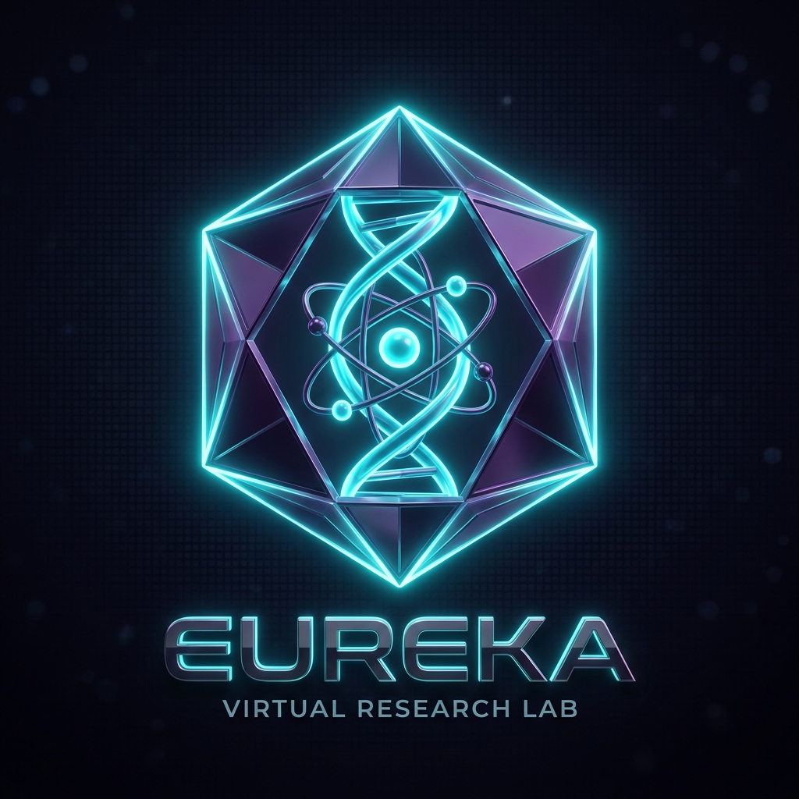
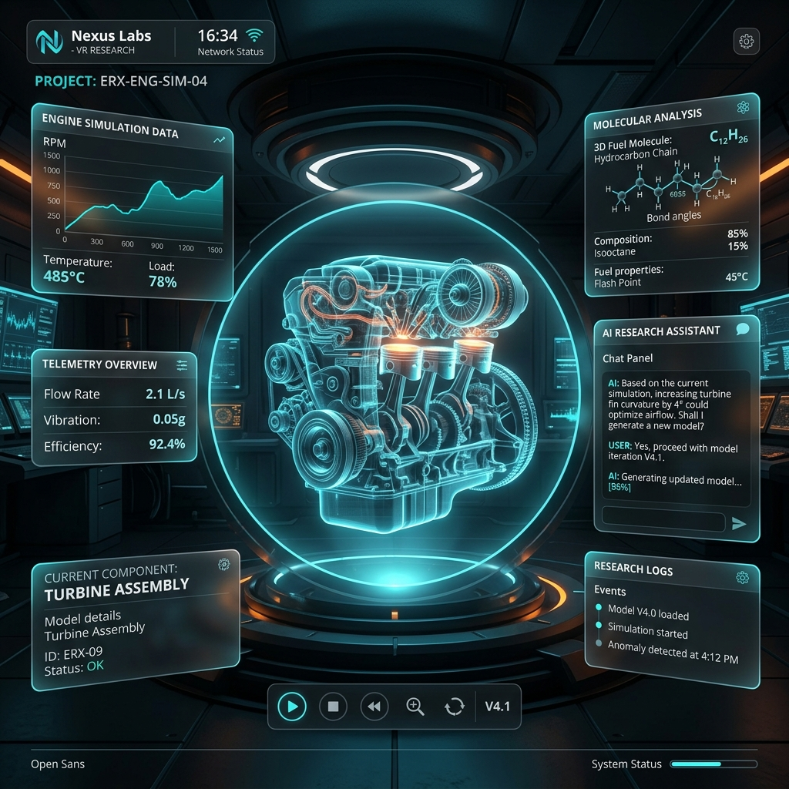
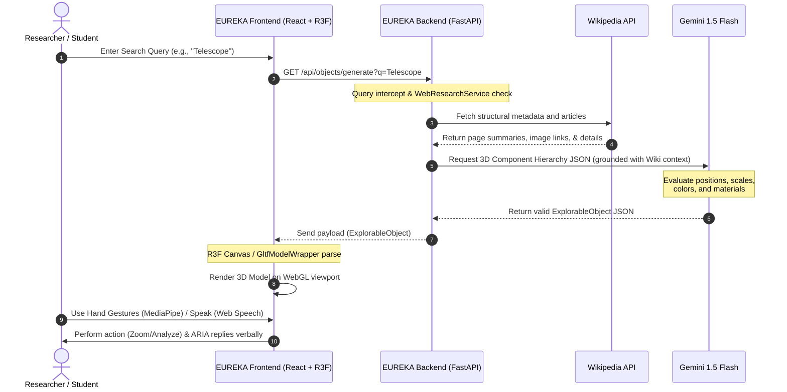

# EUREKA: Universal AI-Powered Virtual Research Lab

<p align="center">
  
</p>

<p align="center">
  <strong>🔬 Making scientific discovery and advanced research accessible to everyone, everywhere, for free. 🚀</strong>
</p>

<p align="center">
  
  
  
  
</p>

<p align="center">
  
  
  
  
</p>

---

## 📖 Table of Contents

- [💡 Project Overview & Live View](#-project-overview--live-view)
- [🎥 Interactive Video Demo](#-interactive-video-demo)
- [✨ Key Features Breakdown](#-key-features-breakdown)
- [🧠 ARIA & The Multi-Agent Mesh](#-aria--the-multi-agent-mesh)
- [🏗️ System Architecture & Workflow](#️-system-architecture--workflow)
- [💻 Language & Technology Breakdown](#-language--technology-breakdown)
- [📂 Detailed Project Structure](#-detailed-project-structure)
- [🚀 Quick Start (Docker & Local)](#-quick-start-docker--local)
- [🛡️ Security & Compliance](#️-security--compliance)
- [🧪 Automated Test Suite](#-automated-test-suite)
- [👑 Founder & Developer](#-founder--developer)
- [📄 License & Citation](#-license--citation)

---

## 💡 Project Overview & Live View

Below is a visualization of the interactive **EUREKA Cyber-Lab Dashboard** in action. Built for modern browsers, the dashboard features a glassmorphic dashboard, real-time particle tracking graphs, active voice/gesture status trackers, and a fully interactive 3D rendering canvas.

<p align="center">
  
</p>

### 🎥 Interactive Video Demo

https://github.com/Minato95-ayu/EUREKA/raw/main/docs/assets/eureka_demo.mp4

*(If the video player does not load automatically in your browser, you can **[Click Here to Watch the Demo Video](

https://github.com/user-attachments/assets/42991c54-74c8-4405-86b3-b588a8f99619

)**)*

**EUREKA** is an open-source, AI-powered virtual simulation space that bridges physical properties with interactive 3D structures. By feeding **Wikipedia structural summaries** into the **Google Gemini 1.5 Flash API**, EUREKA creates realistic, interactive component-level models of mechanical systems, tools, and molecular shapes. 

Users can manipulate models using **voice controls** and **hand gestures** via their webcam, run real-time physics collisions, compute chemical properties, and download auto-generated research papers.

---

## ✨ Key Features Breakdown

### 🤖 1. Grounded 3D Generation
*   **Wikipedia API Context Ingestion**: Pre-fetches dimensions, materials, and colors from Wikipedia REST APIs before passing requests to Gemini to guarantee that generated models correspond to physical reality.
*   **Gemini 3D Assembly**: Dynamically structures complex system graphs (e.g., piston rods positioned inside cylinders) with customized scales and risk indexes.
*   **Three.js Custom Wrapper**: Features an advanced wrapper using `@react-three/drei`'s `useGLTF` to dynamically render custom external models alongside procedural geometric components.

### 🖖 2. Natural User Interfaces (NUI)
*   **MediaPipe Hand Tracking**: Real-time canvas manipulation using webcam frames:
    *   *Pinch Fingers*: Zoom In / Zoom Out.
    *   *Clench Fist*: Reset Camera and Positions.
    *   *Point Index*: Highlight & Inspect Component.
    *   *Horizontal Swipe*: Switch active tab panel.
*   **Web Speech API Integration**: Local speech recognition for direct vocal commands (e.g., *"ARIA, analyze the engine block"*) with high-quality synthesized speech replies.

### 🧪 3. Dual Simulation Engines
*   **3D Verlet Physics**: Real-time calculation of particle momentum, kinetic energy tracking, Van der Waals force, and electrostatic Coulomb fields.
*   **RDKit Molecular Engine**: Determines molecular weights, logP partition coefficients, hydrogen bond donors/acceptors, and automatically predicts chemical reaction routes.

---

## 🧠 ARIA & The Multi-Agent Mesh

EUREKA coordinates five specialized sub-agents working under **ARIA** to provide comprehensive analysis:

```
                            ┌─────────────────────────────────┐
                            │    ARIA (Helper Coordinator)    │
                            └────────────────┬────────────────┘
                                             │
                  ┌──────────────────┬───────┴──────────┬──────────────────┐
                  ▼                  ▼                  ▼                  ▼
          ┌──────────────┐   ┌──────────────┐   ┌──────────────┐   ┌──────────────┐
          │  Explainer   │   │   Analyzer   │   │   Thinker    │   │  Researcher  │
          │ (Simplicity) │   │ (Statistics) │   │ (What-Ifs)   │   │(Peer Papers) │
          └──────────────┘   └──────────────┘   └──────────────┘   └──────────────┘
```

| Agent | Core Objective | Key Output Payload |
| :--- | :--- | :--- |
| **🧠 ARIA (Helper)** | Command router & user interface coordinator | Orchestrates task delegation and compiles final conversational output. |
| **🔬 Explainer** | Deconstructs highly complex engineering & scientific mechanics | Easy-to-read explanations, definitions, and analogies. |
| **📊 Analyzer** | Computes mathematical properties and handles telemetry | Volumes, mass, materials, structural risks, and coordinate transformations. |
| **🔮 Thinker** | Simulates hypothetical adjustments (What-if logic) | Failure predictions, structural vulnerabilities, and risk analysis. |
| **📚 Researcher** | Searches academic paper repositories for grounding data | Extracts and cites DOI references from ArXiv and PubMed. |

---

## 🏗️ System Architecture & Workflow

Below is the execution flow from the moment a user submits a search query to the rendering of the interactive 3D cyber-lab:



---

## 💻 Language & Technology Breakdown

EUREKA leverages a multi-tier programming model. The following breakdown maps the repository's codebase statistics (detected by GitHub) directly to their operational roles and under-the-hood machine acceleration technologies:

| Language | Repository % | Role & Component Area | Under-the-Hood Technologies |
| :--- | :--- | :--- | :--- |
| **🐍 Python** | **73.2%** | FastAPI Server, AI Multi-Agent Core, Verlet 3D Physics Simulator | **C++** (RDKit chemistry bindings), **Cython** (`uvloop` high-concurrency event loops) |
| **🔷 TypeScript** | **20.6%** | Cyber-lab Dashboard (React 19), Automation Scraper (BullMQ, Node.js) | **WebAssembly (Wasm)** (MediaPipe deep learning), **GLSL** (GPU shaders via R3F/Three.js) |
| **🎨 CSS** | **4.7%** | Dashboard glassmorphism, responsive grids, and cyber-lab visual effects | Flexbox, CSS variables, hardware-accelerated filters |
| **🐚 Shell** | **1.0%** | Setup Automation, deployment scripts, and local model loaders | Bash (Linux) & PowerShell (Windows) scripting |
| **🐳 Dockerfile** | **0.3%** | Container build scripts for database, Redis, frontend, and backend | Multi-stage secure build, unprivileged user execution boundaries |
| **💛 JavaScript** | **0.1%** | Web Speech API wrappers, config loaders, and bundling hooks | Browser Web Speech Recognition & Web Audio APIs |
| **🧡 HTML** | **0.1%** | Main single-page web template & meta search engine optimization tags | Semantic HTML5 structure |

### ⚙️ Under-the-Hood Performance Engines

While the primary code repository consists of Python and TypeScript, EUREKA's runtime environment is accelerated by high-performance compiled engines operating at a native level:

1. **C++ (Machine-Level Simulation & Graph Solving)**:
   - **RDKit Engine**: Performs complex molecular structural analysis, property calculations, and chemical reaction pathway estimations natively in C++ for maximum throughput.
   - **MediaPipe Backend**: Hand gesture detection algorithms and coordinate extraction are compiled as highly-optimized C++ libraries.

2. **WebAssembly / Wasm (In-Browser Neural Execution)**:
   - MediaPipe's deep learning hand tracking models are executed directly within the browser using WebAssembly compiled binaries, allowing for 60FPS gesture interactions without sending video frames to any remote server.

3. **GLSL - OpenGL Shading Language (Direct GPU Graphics)**:
   - The interactive 3D virtual viewport communicates directly with the GPU. Realistic rendering, shadows, metallic materials, and glowing particle collisions are compiled into native WebGL fragment and vertex shaders.

4. **Cython & libuv (High-Concurrency Server Loop)**:
   - The FastAPI backend utilizes `uvloop` (a Cython-compiled execution loop built on Node's `libuv` system), giving the Python backend network performance metrics comparable to Go (Golang) and native Node.js.

---

## 📂 Detailed Project Structure

```bash
EUREKA/
├── eureka-backend/             # FastAPI Backend Service (Python 3.11+)
│   ├── app/
│   │   ├── agents/             # AI agent files (helper.py, explainer.py, thinker.py, etc.)
│   │   ├── api/                # API controllers (objects.py, ws.py, auth.py)
│   │   ├── services/           # Core calculations (gemini_3d_service.py, physics_engine.py, rdkit)
│   │   └── data/               # Procedural templates & demo objects (e.g., car_engine.json)
│   ├── tests/                  # Backend unit & integration test files
│   └── main.py                 # Core entry point
│
├── eureka-frontend/            # React Client Application (React 19 + TypeScript + Vite)
│   ├── src/
│   │   ├── components/         # Canvas3D.tsx, GltfWrapper.tsx, CameraFeed.tsx, ARIAAssistant.tsx
│   │   ├── pages/              # CyberDashboard.tsx, Settings.tsx
│   │   └── App.tsx             # Main router, state machine, and MediaPipe mapping loop
│   └── package.json
│
├── eureka-automation/          # TypeScript scrapers & background queues
│   ├── src/
│   │   ├── scrapers/           # Academic crawling engines (ArXiv, PubMed)
│   │   └── queue/              # BullMQ message queue setup
│   └── package.json
│
├── kubernetes/                 # Production orchestration manifests
├── helm/                       # Configurable Helm charts for cloud rollouts
├── monitoring/                 # Prometheus dashboards and Grafana metrics config
└── docker-compose.yml          # Container configuration for all services
```

---

## 🚀 Installation & Setup

### Environment Configuration
Create a `.env` file in the root directory before launching:
| Parameter | Default Value | Description |
| :--- | :--- | :--- |
| `GEMINI_API_KEY` | *Required* | API Key from Google AI Studio. |
| `DATABASE_URL` | `postgresql://user:pass@db:5432/eureka` | PostgreSQL connection string. |
| `REDIS_URL` | `redis://redis:6379/0` | Redis cache and queue address. |
| `OLLAMA_HOST` | `http://ollama:11434` | Endpoint for local model fallbacks. |

---

### Option 1: Multi-Container Launch via Docker Compose (Recommended)

```bash
# Clone the repository
git clone https://github.com/Minato95-ayu/EUREKA.git
cd EUREKA

# Launch all services in background mode
docker-compose up --build -d

# Initialize local fallback model (Ollama)
docker-compose exec ollama ollama pull llama3
```

*   **Lab Interface**: [http://localhost:3000](http://localhost:3000)
*   **FastAPI Documentation**: [http://localhost:8000/docs](http://localhost:8000/docs)

---

### Option 2: Local Manual Setup (Development Mode)

#### 1. Backend Server Setup
Ensure Python 3.11+ and C++ headers (for RDKit) are configured locally:
```bash
cd eureka-backend
python -m venv venv

# Activate Environment
# Windows:
.\venv\Scripts\activate
# Linux/macOS:
source venv/bin/activate

# Install libraries
pip install -r requirements.txt

# Run server
python main.py
```

#### 2. Frontend Client Setup
```bash
cd ../eureka-frontend
npm install
npm run dev
```

---

## 🛡️ Security & Compliance

EUREKA follows strict data safety and deployment patterns to protect server resources:

*   **DDOS Shield**: Integrated with `slowapi` to limit excessive client calls on computational-heavy 3D generation endpoints.
*   **Secure Session Sign-In**: Powered by stateless JWT (HS256) keys with automatic 24-hour cookie decay.
*   **HTTP Strict Transport security**: Nginx configurations enforce TLS 1.3 and block cross-frame scripting (XSS) via customized policy headers.
*   **Isolation**: Docker runtimes execute frontend/backend processes under non-privileged unprivileged user definitions.

---

## 🧪 Automated Test Suite

We maintain an active unit testing standard across simulation engines and AI routing networks.

```bash
# Go to backend folder
cd eureka-backend

# Execute tests with code coverage metrics
pytest -v --cov=app
```

---

## 👑 Founder & Developer

<table border="0" cellpadding="10" cellspacing="0">
  <tr>
    <td valign="top" width="180">
      
    </td>
    <td valign="top">
      <h3>Ayush Kaushik</h3>
      <p><strong>Lead Architect & Creator of EUREKA</strong></p>
      <ul>
        <li>💻 <strong>Role:</strong> Full-Stack AI Engineer & System Designer</li>
        <li>🎓 <strong>Status:</strong> Developer & Creator | Google Hackathon Participant (IIT Delhi)</li>
        <li>🌐 <strong>GitHub:</strong> <a href="https://github.com/Minato95-ayu">@Minato95-ayu</a></li>
        <li>✉️ <strong>Email:</strong> <a href="mailto:ayushkaushik1441@gmail.com">ayushkaushik1441@gmail.com</a></li>
      </ul>
      <p><em>"EUREKA was built to democratize access to advanced scientific research interfaces. By combining spatial computing, voice controls, and LLM-driven generation, we enable students and researchers to visualize and experiment with complex structures without expensive laboratory setups."</em></p>
    </td>
  </tr>
</table>

---

## 📄 License & Citation

Distributed under the **MIT License**. See `LICENSE` for details.

If you leverage EUREKA in an academic context, please cite the project:

```bibtex
@software{eureka2026,
  title={EUREKA: Universal AI-Powered Virtual Research Lab},
  author={Kaushik, Ayush},
  year={2026},
  url={https://github.com/Minato95-ayu/EUREKA}
}
```

<p align="center">
  Made with ❤️ for scientific education and global research. <br/>
  <strong>EUREKA — Where Discovery Begins. 🔬🚀</strong>
</p>
